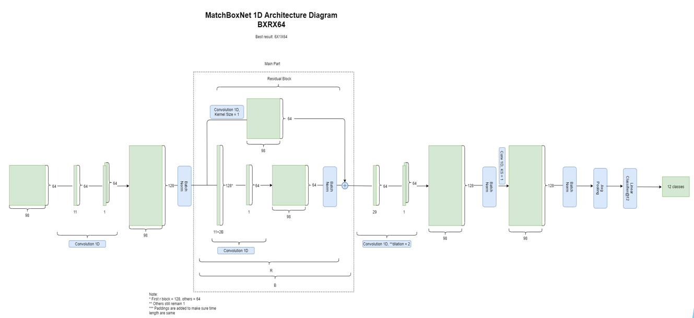

# MatchBox Keyword Spotting

---

## Introduction

This is a small-footprint keyword spotting project. It is using Pytorch. The official MatchBox link is 

[NeMo/Speech_Commands.ipynb at main · NVIDIA/NeMo](https://github.com/NVIDIA/NeMo/blob/main/tutorials/asr/Speech_Commands.ipynb)

## Requirements

1. Python 3.7, 3.8
2. Pytorch 1.8.1 and above

## Architecture Diagram



## Installation

Install using pip.

```bash
pip install -r requirements.txt
```

## Code structure

Below is the file structure of the project.

```bash
.
|-- matchbox/
|-- data/
|-- saved_models/
|-- dataloader.py
|-- download_and_extract_noise_file.py
|-- run.sh
|-- testing.py
|-- trainer.py
|-- vad_torch.py
|-- requirements.txt
|-- compute_meand_std.py
```

- matchbox: matchbox model
- data: consists of json data file. See the json files in the folder to know more details.

    Note: the input dataset is following the json format below.

    ```json
    {"audio_filepath": "/path/to/audio_wav_0.wav", "duration": time_in_sec_0, 
    "label": target_label_0}
    ```

- saved_models: consists of trained model

## Training

1. Run the command below to start the training.

    ```bash
    ./run.sh
    ```

2. See the results.

## Testing

1. Modify the line in run.sh 

    ```bash
    python3 testing.py -saved_model save_models/check_point_48_0.9694038245219347
    ```

2. See the results.